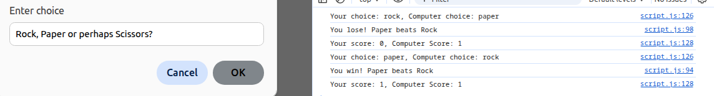
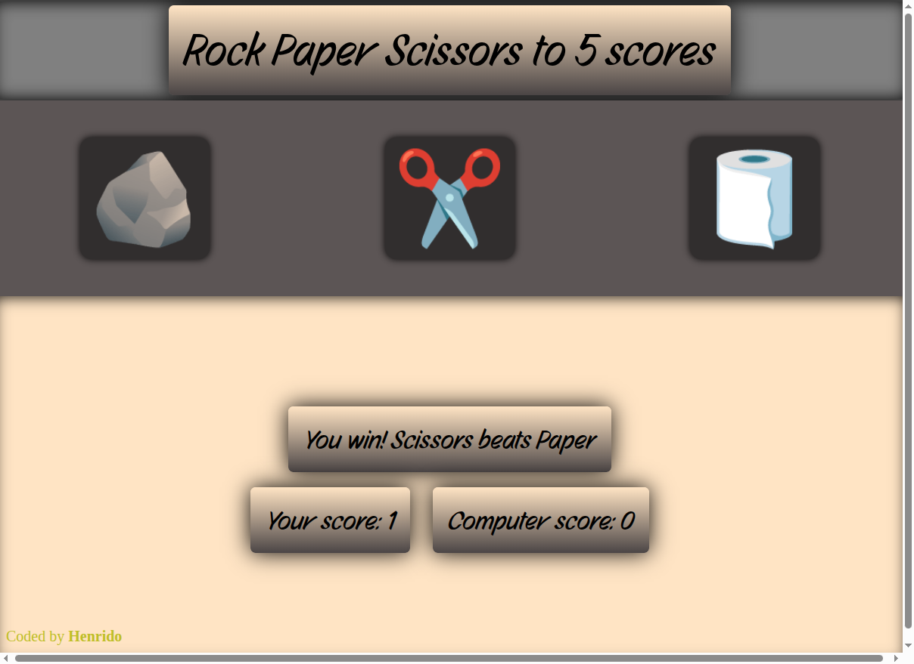

# rock-paper-scissors
a rock paper scissors project from TOP.

Description: 

A game of 5 rounds of rock paper scissors with a computer that generates random output each time.

What i learned:

I learned a lot of basic javascript concepts.
I also learned to use switch more efficiently and tried to use a loop as well and it worked!

Revisit of project:

I learned a lot about selectors and manipulating the dom, i really enjoyed this project!

Screenshot:

Revisit screenshot:

